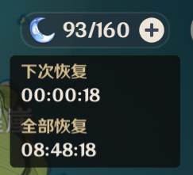

# 材料

[[toc]]

## 树脂

树脂用于完成副本以及击杀世界 Boss 后兑换奖励。

### 原淬树脂

原淬树脂会根据现实世界时间，每 8 分钟恢复 1 点。

::: tip 专家建议
尽量保持原淬树脂不溢出，不然太浪费了。
:::

具体消耗如下：

| 副本类型  | 所需树脂数 | 是否可以使用浓缩树脂 |   挑战次数限制   |
| :-------: | :--------: | :------------------: | :--------------: |
| 地脉泛出  |     20     |          是          |        ∞         |
|   秘境    |     20     |          是          |        ∞         |
| 区域 Boss |     40     |          否          | ∞ （有冷却时间） |
| 周常 Boss |     60     |          否          |     每周一次     |

### 浓缩树脂

浓缩树脂可兑换双倍奖励，可以在合成台中合成。以此可以大大节约时间提升效率。

::: tip 专家建议
尽管如此，为了纪行的周常任务能够全部达成，建议自行规划的使用。
当然，由于纪行经验严重溢出，如果不缺资源可以不用这么着急。
:::
